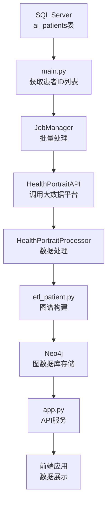

# 健康画像ETL项目


一个基于Python + Neo4j的健康画像数据ETL工程，实现从大数据平台获取患者健康画像数据，经过处理后存储到Neo4j图数据库中，并提供RESTful API服务。

## 🏗️ 项目架构

```
etl_neo4j/
├── main.py                    # 🎯 主入口：ETL调度执行
├── app.py                     # 🌐 Web API服务入口
├── config/                    # ⚙️ 配置管理
│   ├── settings.py           # 数据库、API配置
│   └── etl_state.json        # ETL状态追踪
├── etl/                      # 🔄 ETL核心模块
│   ├── core/
│   │   └── etl_patient.py    # 患者数据处理核心逻辑
│   ├── processors/
│   │   └── health_portrait.py # 健康画像处理器
│   └── utils/                # 🛠️ 工具类
│       ├── api.py           # API调用封装
│       ├── db.py            # Neo4j连接管理
│       ├── sqlserver.py     # SQL Server连接(获取患者ID)
│       └── logger.py        # 日志管理
├── scheduler/               # 📅 调度管理
│   ├── job_manager.py      # 作业管理器
│   └── scheduler.py        # 定时调度器
├── files/                  # 📄 测试数据文件
├── templates/              # 🎨 HTML模板
├── static/                 # 📦 静态资源
├── tests/                  # 🧪 测试文件
├── logs/                   # 📋 日志文件
└── archive/                # 📦 归档文件
```

## 🔄 数据流程



## 🚀 快速开始

### 环境要求

- Python 3.8+
- Neo4j 5.0+
- SQL Server (用于获取患者ID)
- 大数据平台API访问权限

### 安装依赖

```bash
pip install -r requirements.txt
```

### 配置文件

修改 `config/settings.py` 中的配置：

```python
# Neo4j配置
NEO4J_URI = "bolt://neo4j.haxm.local:7687"
NEO4J_USER = "neo4j"
NEO4J_PASSWORD = "your_password"

# 大数据平台API配置
BIGDATA_API_BASE_URL = "http://your-api-server:port"

# SQL Server配置 (患者ID来源)
SQL_HOST = "your-sql-server"
SQL_DATABASE = "health_portrait"
SQL_USER = "your_username"
SQL_PASSWORD = "your_password"
```

### 运行ETL任务

```bash
# 执行单次ETL数据处理
python main.py

# 或使用启动脚本（推荐）
./start.sh          # Linux/Mac
start.bat           # Windows
```

### 启动定时调度

```bash
# 启动ETL定时调度器
./scheduler_start.sh    # Linux/Mac
scheduler_start.bat     # Windows

# 或直接使用Python
python -c "from scheduler.scheduler import ETLScheduler; scheduler = ETLScheduler(); scheduler.start(24)"
```

### 启动API服务

```bash
# 启动Web API服务
python app.py
```

服务启动后，访问 `http://localhost:5000/api/docs` 查看API文档。

## 📊 核心功能

### ETL数据处理

- **单次执行**：通过`main.py`或`start.sh`执行一次ETL任务
- **定时调度**：通过`scheduler_start.sh`启动持续的定时ETL任务
- **增量ETL**：基于时间戳的增量数据处理
- **批量处理**：支持多线程批量处理患者数据
- **容错机制**：完善的错误处理和重试策略
- **状态追踪**：持久化ETL执行状态

### 图谱构建

- **患者实体**：基础信息、证件信息、婚育状况
- **就诊记录**：门诊/住院/体检，关联医院、科室、医生
- **医疗数据**：诊断、检查、检验、处方等
- **家族关系**：配偶、子女、父母关系图谱
- **生活方式**：吸烟史、饮酒史、睡眠评估等

### API服务

| 接口 | 描述 | 方法 |
|------|------|------|
| `/api/patients/{id}/dashboard` | 患者仪表盘概览 | GET |
| `/api/patients/{id}/encounters` | 就诊记录列表 | GET |
| `/api/patients/{id}/history/medical` | 既往医疗史 | GET |
| `/api/patients/{id}/history/family` | 家族史 | GET |
| `/api/patients/{id}/allergies` | 过敏史 | GET |
| `/api/patients/{id}/family-graph` | 家族关系图谱 | GET |

## ⚙️ 配置说明

### 调度配置

```python
BATCH_SIZE = 50          # 批处理大小
MAX_WORKERS = 1          # 并发线程数(避免死锁)
RETRY_TIMES = 3          # 重试次数
RETRY_DELAY = 5          # 重试延迟(秒)
```

### 日志配置

```python
LOG_DIR = "logs"         # 日志目录
LOG_LEVEL = "INFO"       # 日志级别
```

## 🗄️ 数据模型

### 核心节点类型

- **Patient**: 患者节点
- **Encounter**: 就诊记录
- **Condition**: 疾病/诊断
- **Hospital**: 医院
- **Department**: 科室
- **Provider**: 医生
- **LabTestReport**: 检验报告
- **Examination**: 检查记录
- **Allergen**: 过敏原
- **LifestyleFact**: 生活方式事实

### 关系类型

- **HAD_ENCOUNTER**: 患者-就诊关系
- **RECORDED_DIAGNOSIS**: 就诊-诊断关系
- **SPOUSE_OF**: 配偶关系
- **PARENT_OF**: 父子关系
- **HAS_ALLERGY_TO**: 过敏关系
- **HAS_FAMILY_HISTORY**: 家族史关系

## 📁 文件说明

### 核心文件

- `main.py`: ETL单次执行入口
- `app.py`: Web API服务入口
- `config/settings.py`: 项目配置文件
- `start.sh/start.bat`: 项目启动脚本
- `scheduler_start.sh/scheduler_start.bat`: 定时调度启动脚本

### 模块说明

- `etl/core/`: ETL核心逻辑，包含数据转换和图谱构建
- `etl/processors/`: 数据处理器，负责协调数据处理流程
- `etl/utils/`: 工具类，包含数据库连接、API调用等
- `scheduler/`: 调度管理，负责批量处理和作业管理

### 存档文件

`archive/` 目录包含项目开发过程中的历史文件和测试文件：
- 旧版本的代码文件
- 测试数据样例
- 开发过程中的临时文件

## 🔧 开发指南

### 代码规范

- 使用Black进行代码格式化
- 使用Flake8进行代码检查
- 遵循PEP 8编码规范

### 测试

```bash
# 运行测试
python -m pytest tests/

# 运行单个测试文件
python -m pytest tests/test_specific.py
```

### 日志

项目使用结构化日志，日志文件保存在 `logs/` 目录下：
- `main.log`: 主程序日志
- `api.log`: API调用日志
- `health_portrait.log`: 数据处理日志

## 📈 监控与维护

### 状态监控

- ETL状态文件：`config/etl_state.json`
- 日志监控：查看 `logs/` 目录下的日志文件
- Neo4j数据库监控：通过Neo4j Browser查看数据状态

### 常见问题

1. **连接超时**: 检查网络连接和API配置
2. **内存不足**: 调整BATCH_SIZE配置
3. **数据重复**: 检查唯一性约束设置

## 🤝 贡献

欢迎提交Issue和Pull Request来改进项目。

## 📄 许可证

本项目采用MIT许可证。

## 📞 联系方式

如有问题，请联系开发团队。